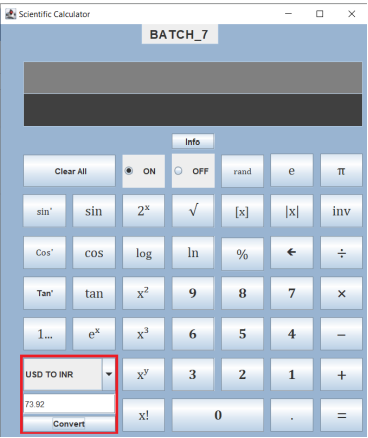

# Scientific Calculator

This is Basic Implementation of Scientific Calculator in Java using Swing Library.

**Calculator also Includes**:

1. Trigonometric Functions
2. Logarithmic Functions
3. Exponential Functions
4. Power Functions
5. Currency Converter

## Documentation

The Documentation of this project can be found [Here]()

### Technology Used

**IDE** - Eclipse

**Window builder package **- we have used this to simplify our code to  make it easier to interpret and create the GUI

### UML Diagram

### Demo

#### Basic Calculations

#### Exponential

#### Trignometric Funtions

#### Power Functions

#### Converter

## Contributors

B.E.Pranav Kumaar

🔥 [twitter](https://twitter.com/bepranavkumaar1)

⚡️ [LinkedIn](https://www.linkedin.com/in/pranav-kumaar/)

❄️ [Github](https://github.com/genpranav)

Divi Eswar Choudary

Student ID @Amrita Vishwa Vidyapeetham - CB.EN.U4AIE20012

🔥 [twitter](https://twitter.com/eswar_divi)

⚡️ [LinkedIn](https://www.linkedin.com/in/eswar-divi-963259196/)

❄️ [Github](https://github.com/EswarDivi)

Harsha Dabbara

Student ID @Amrita Vishwa Vidyapeetham - CB.EN.U4AIE20010

🔥 [twitter](https://twitter.com/dabbara_harsha)

⚡️ [LinkedIn](https://www.linkedin.com/in/harsha-dabbara-b09679237/)

❄️ [Github](https://github.com/dabby-dabbs)

Dinesh Kumar M.R

Student ID @Amrita Vishwa Vidyapeetham - CB.EN.U4AIE20011

